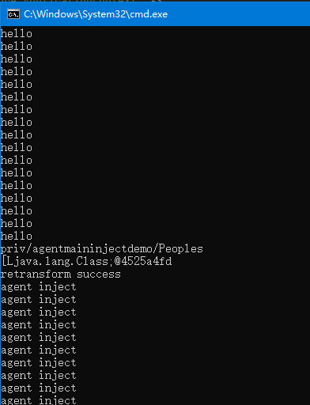

# Javaagent-Project
Things for learning javaagent：
premain、agentmain
some try for agentmain instrumentation，ex：reTrainformer 、reDefineclass

2月18日，add agentmaindemo：
agentfordemo-1.0-SNAPSHOT.jar
attachfordemo-1.0-SNAPSHOT.jar
mainfordemo-1.0-SNAPSHOT.jar

using ：
agentfordemo-1.0-SNAPSHOT.jar放到D:\githubprogram\Testforjavaagent\  下就可以测试了

